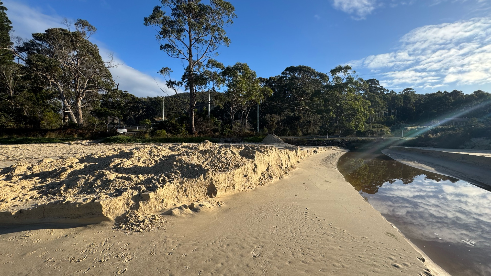
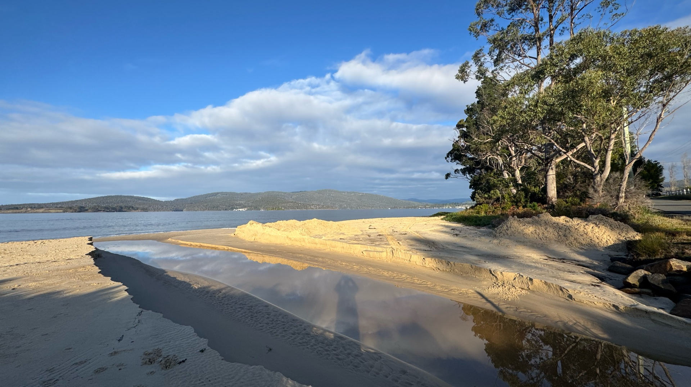
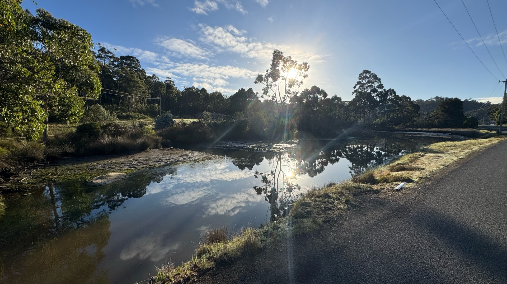
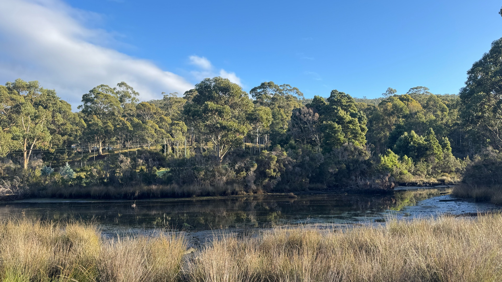
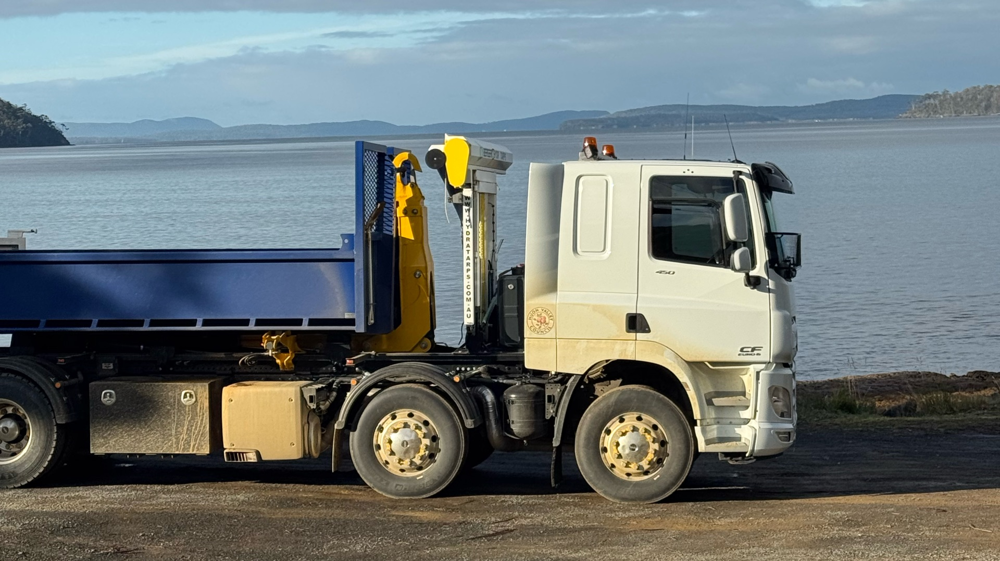
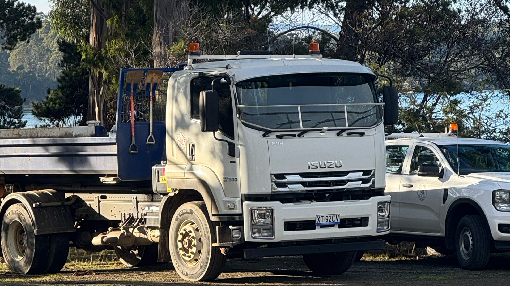
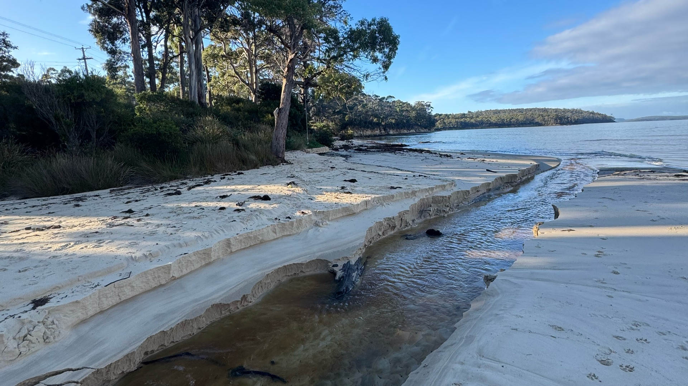
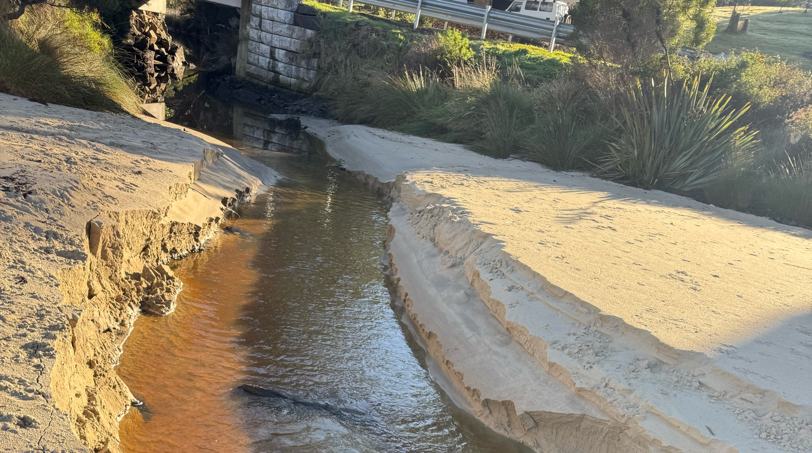

# Dover and Surrounds Adhoc

_Auto-generated from the backup. Do not edit — regenerated each run._

**Observations:** 2

## Fields

- **Observations** — `textarea`
- **Photos** — `image`

## Observations

### 2026-06-24T09:46:58+00:00 — Bells Lagoon
**Observer:** mhdoverlc  ·  **Location:** -43.313011631, 147.03889344  ·  **ID:** `019ef6ea-2bae-7a8c-bf35-0948c745ab0d`

| Field | Value |
| --- | --- |
| Observations | Appears someone has opened/dug out sea entrance bells lagoon The lagoon smells a bit anoxic Tide 0.7m rising, sea water just starting to flow into lagoon Huon valley council had some trucks parked nearby |
| Photos |       |

### 2026-06-24T09:40:00+00:00 — Glenbervie Rivulet
**Observer:** mhdoverlc  ·  **Location:** -43.31235, 147.04628  ·  **ID:** `019ef742-d390-75dc-b1ed-84e520818b6a`

| Field | Value |
| --- | --- |
| Observations | Flowing out to bay, tide 0.7m |
| Photos |   |

---

_Licensing: project & contributor content is CC BY 4.0; uploaded third-party resources are not licensed for reuse; code is MIT. See [LICENSE.md](../../../../../LICENSE.md)._
