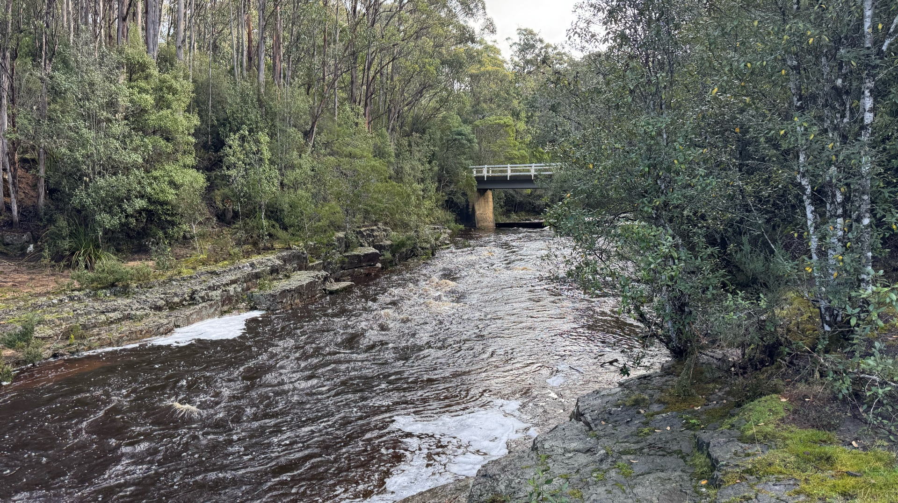
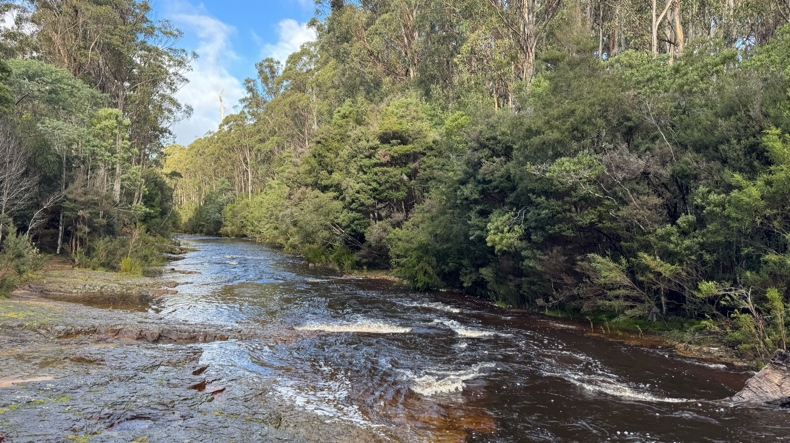
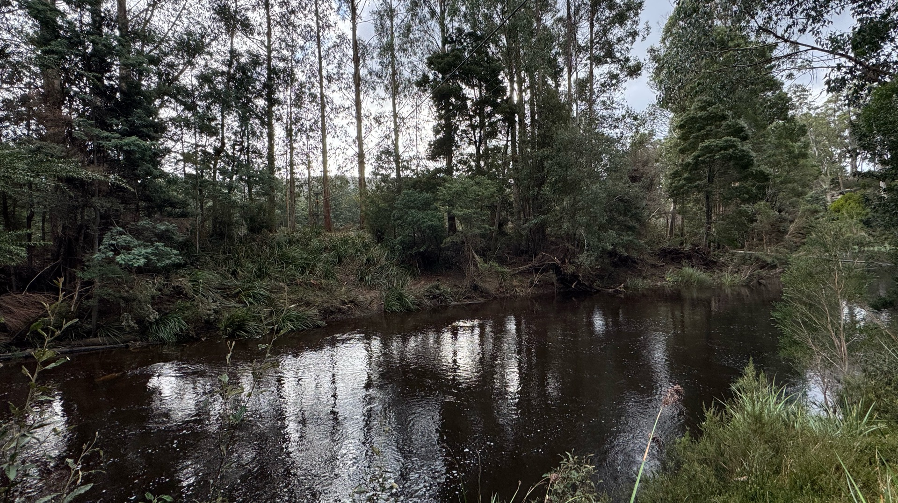
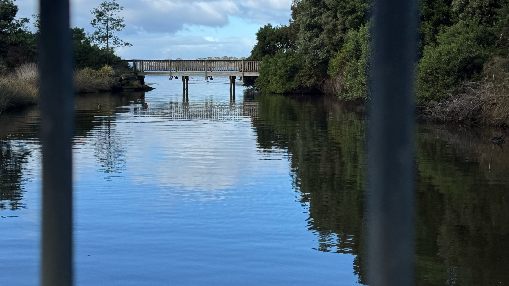
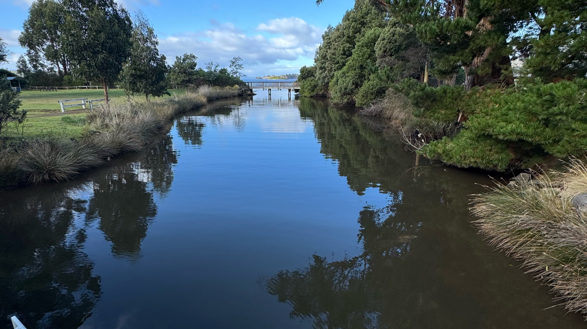
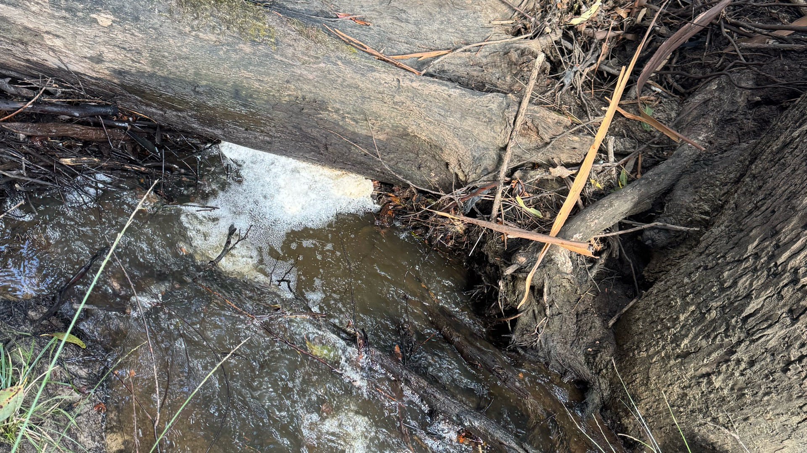
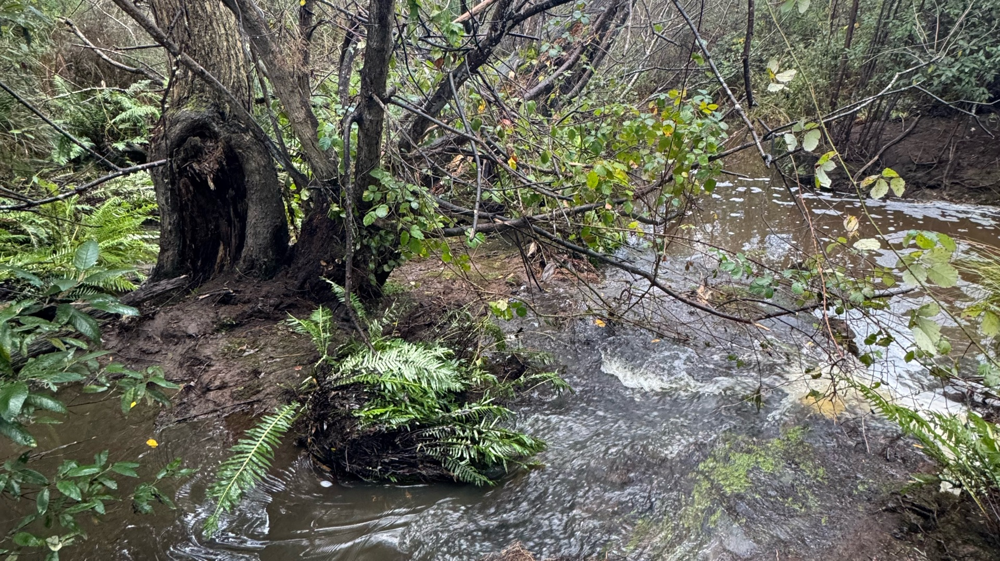

# Dover Landcare Water Quality

_Auto-generated from the backup. Do not edit — regenerated each run._

**Observations:** 6

## Fields

- **Waterwatch Physcio-chemical Monitoring Data Sheet** — `description`
- **Monitor's Name(s) - NOT published publically** — `text` _(private)_
- **Monitor's Initials (or alias) - PUBLIC** — `text`
- **Water Depth (cm)** — `number`
- **Width (cm)** — `number`
- **Flowing** — `dropdown`
- **Rainfall Last 24h (mm)** — `number`
- **Air Temperature (C)** — `number`
- **Other Observations** — `multiple_choice`
- **Further / ad-hoc Observations** — `textarea`
- **Comments / Notes** — `textarea`
- **Equipment** — `description`
- **Hanna Combo Meter #** — `text`
- **Hanna Combo Last Calibrated** — `text`
- **TDScan Meter #** — `text`
- **TDScan Last Calibrated** — `text`
- **Measurements** — `description`
- **pH** — `number`
- **TDS (ppm) / salinity** — `number`
- **Water Temperature (C)** — `number`
- **Electrical Conductivity (mS / uS)** — `number`
- **Electrical Conductivity Unit** — `dropdown`
- **Dissolved Oxygen %s** — `number`
- **Dissolved Oxygen Temperature (C)** — `number`
- **Dissolved Oxygen in mg/L** — `number`
- **Turbidity (NTU)** — `number`
- **Turbidity Measurement Type** — `dropdown`
- **Nutrient Samples Collected** — `multiple_choice`
- **Photo(s)** — `description`
- **Site Conditions Photograph - PUBLIC** — `image`

## Observations

### 2026-06-14T12:50:00+00:00 — ESP050 Esperance River Conservation Area (maybe ESP010)
**Observer:** mhdoverlc  ·  **Location:** -43.298965, 146.9134378  ·  **ID:** `019ec64a-5093-760e-bf95-5cc35997280c`

| Field | Value |
| --- | --- |
| Monitor's Initials (or alias) - PUBLIC | EB JE MH |
| Water Depth (cm) | 50 |
| Width (cm) | 600 |
| Flowing | High |
| Rainfall Last 24h (mm) | 2 |
| Other Observations | Foam, Bubbles |
| Ph | 6.9 |
| Temperature (C) | 7.9 |
| Electrical Conductivity | 56 |
| Electrical Conductivity Unit | uS micro-Siemens |
| Dissolved Oxygen %s | 99.5 |
| Turbidity (NTU) | 6 |
| Turbidity Measurement Type | 2100P Turbidimeter |
| Nutrient Samples Collected | None |
| Site Conditions Photograph - PUBLIC |   |

### 2026-06-14T12:25:00+00:00 — ESP100 Esperance River Cableway Above Dover Water Intake
**Observer:** mhdoverlc  ·  **Location:** -43.334185, 146.9657096  ·  **ID:** `019ec650-0f2e-7cad-9f82-beb9494685fc`

| Field | Value |
| --- | --- |
| Monitor's Initials (or alias) - PUBLIC | EB JE MH |
| Water Depth (cm) | 150 |
| Width (cm) | 20000 |
| Flowing | High |
| Rainfall Last 24h (mm) | 2 |
| Other Observations | Foam |
| Ph | 7.4 |
| Temperature (C) | 8.3 |
| Electrical Conductivity | 71 |
| Electrical Conductivity Unit | uS micro-Siemens |
| Dissolved Oxygen %s | 99 |
| Turbidity (NTU) | 7 |
| Turbidity Measurement Type | Tube |
| Nutrient Samples Collected | None |
| Site Conditions Photograph - PUBLIC |  |

### 2026-06-14T11:40:00+00:00 — DOV130 Dover Rivulet Lagoon Kent Beach Rd
**Observer:** mhdoverlc  ·  **Location:** -43.3155877, 147.0230454  ·  **ID:** `019ec63f-1b33-7206-8be6-94b3d18c8812`

| Field | Value |
| --- | --- |
| Monitor's Initials (or alias) - PUBLIC | JE EB MH |
| Water Depth (cm) | 200 |
| Width (cm) | 1500 |
| Flowing | Low |
| Other Observations | Rubbish, Debris |
| Further / ad-hoc Observations | Open to ocean, flowing out |
| Ph | 7.1 |
| Temperature (C) | 10.2 |
| Electrical Conductivity | 23 |
| Electrical Conductivity Unit | mS milli-Siemens |
| Dissolved Oxygen %s | 90 |
| Turbidity (NTU) | 7 |
| Turbidity Measurement Type | Tube |
| Nutrient Samples Collected | None |
| Site Conditions Photograph - PUBLIC |   |

### 2026-06-14T11:02:00+00:00 — DOV070 Dover Rivulet Huon Highway
**Observer:** mhdoverlc  ·  **Location:** -43.2976765, 147.0103537  ·  **ID:** `019ec637-17d2-74db-b524-e148df0e251a`

| Field | Value |
| --- | --- |
| Monitor's Initials (or alias) - PUBLIC | JE EB MH |
| Water Depth (cm) | 20 |
| Width (cm) | 100 |
| Flowing | High |
| Other Observations | Debris, Foam, Bubbles, Erosion |
| Hanna Combo Meter # | 98128 |
| TDScan Meter # | wp-84 |
| Ph | 7 |
| Temperature (C) | 8.7 |
| Electrical Conductivity | 274 |
| Electrical Conductivity Unit | uS micro-Siemens |
| Dissolved Oxygen %s | 92.8 |
| Turbidity (NTU) | 19 |
| Turbidity Measurement Type | Tube |
| Nutrient Samples Collected | None |
| Site Conditions Photograph - PUBLIC |  |

### 2026-06-14T10:20:00+00:00 — DOV110 Dover Rivulet South Gate Market
**Observer:** mhdoverlc  ·  **Location:** -43.3105898, 147.0170049  ·  **ID:** `019ec62d-2b1e-70b0-8e4c-afaedbf2ebae`

| Field | Value |
| --- | --- |
| Monitor's Initials (or alias) - PUBLIC | JE EB MH |
| Water Depth (cm) | 10 |
| Width (cm) | 50 |
| Flowing | High |
| Other Observations | Foam, Erosion |
| Hanna Combo Meter # | 98128 |
| TDScan Meter # | Wp-84 |
| Ph | 7.0 |
| Temperature (C) | 8.6 |
| Electrical Conductivity | 350 |
| Electrical Conductivity Unit | uS micro-Siemens |
| Dissolved Oxygen %s | 95.2 |
| Turbidity (NTU) | 10 |
| Turbidity Measurement Type | Tube |
| Nutrient Samples Collected | None |
| Site Conditions Photograph - PUBLIC |  |

### 2025-11-29T10:27:00+00:00 — DOV110 Dover Rivulet South Gate Market
**Observer:** mhdoverlc  ·  **Location:** -43.3105898, 147.0170049  ·  **ID:** `019edd31-b841-79d1-bb48-e7b21a2d1822`

| Field | Value |
| --- | --- |
| Monitor's Initials (or alias) - PUBLIC | SR |
| Flowing | Medium |
| Ph | 7.3 |
| Temperature (C) | 10.6 |
| Electrical Conductivity | 317 |
| Electrical Conductivity Unit | uS micro-Siemens |
| Turbidity (NTU) | 20 |
| Turbidity Measurement Type | Tube |

---

_Licensing: project & contributor content is CC BY 4.0; uploaded third-party resources are not licensed for reuse; code is MIT. See [LICENSE.md](../../../../../LICENSE.md)._
