# Dover Landcare Water Quality

_Auto-generated from the backup. Do not edit — regenerated each run._

**Observations:** 11

**Spreadsheet:** [observations.csv](observations.csv) — every observation below as a table, one row each, one column per field.

## Fields

- **Waterwatch Physcio-chemical Monitoring Data Sheet** — `description`
- **Monitor's Name(s) - NOT published publically** — `text` _(private)_
- **Monitor's Initials (or alias) - PUBLIC** — `text`
- **Water Depth (cm)** — `number`
- **Width (cm)** — `number`
- **Flowing** — `dropdown`
- **Rainfall Last 24h (mm)** — `number`
- **Air Temperature (C)** — `number`
- **Other Observations** — `multiple_choice`
- **Further / ad-hoc Observations** — `textarea`
- **Comments / Notes** — `textarea`
- **Equipment** — `description`
- **Hanna Combo Meter #** — `text`
- **Hanna Combo Last Calibrated** — `text`
- **TDScan Meter #** — `text`
- **TDScan Last Calibrated** — `text`
- **Measurements** — `description`
- **pH** — `number`
- **TDS (ppm) / salinity** — `number`
- **Water Temperature (C)** — `number`
- **Electrical Conductivity (mS / uS)** — `number`
- **Electrical Conductivity Unit** — `dropdown`
- **Dissolved Oxygen %s** — `number`
- **Dissolved Oxygen Temperature (C)** — `number`
- **Dissolved Oxygen in mg/L** — `number`
- **Turbidity (NTU)** — `number`
- **Turbidity Measurement Type** — `dropdown`
- **Nutrient Samples Collected** — `multiple_choice`
- **Photo(s)** — `description`
- **Site Conditions Photograph - PUBLIC** — `image`

## Observations

### 2026-08-02T11:55:11+00:00 — ESP050 Esperance River Conservation Area (maybe ESP010)
**Observer:** Erika B  ·  **Location:** -43.298965, 146.9134378  ·  **ID:** `019fc049-f839-708e-a983-13be679ac74f`

[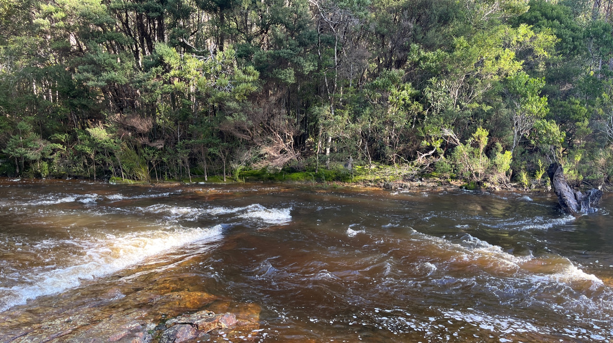](../../../../files/photos_and_files/019fc049-e7c0-786b-990f-1a7a14067d08-44216d21a7da3d7ce0ca0bce834e90d9f900e568.jpg)

| Field | Value |
| --- | --- |
| Monitor's Initials (or alias) - PUBLIC | MH, EB |
| Water Depth (cm) | 50 |
| Width (cm) | 600 |
| Flowing | Medium / High |
| Rainfall Last 24h (mm) | 0 |
| Air Temperature (C) | 11 |
| Other Observations | Foam |
| pH | 7.21 |
| Water Temperature (C) | 6.4 |
| Electrical Conductivity (mS / uS) | 56 |
| Electrical Conductivity Unit | uS micro-Siemens |
| Dissolved Oxygen %s | 101.7 |
| Dissolved Oxygen Temperature (C) | 5.6 |
| Turbidity (NTU) | 3.84 |
| Turbidity Measurement Type | 2100P Turbidimeter |
| Nutrient Samples Collected | None |
| Site Conditions Photograph - PUBLIC |  [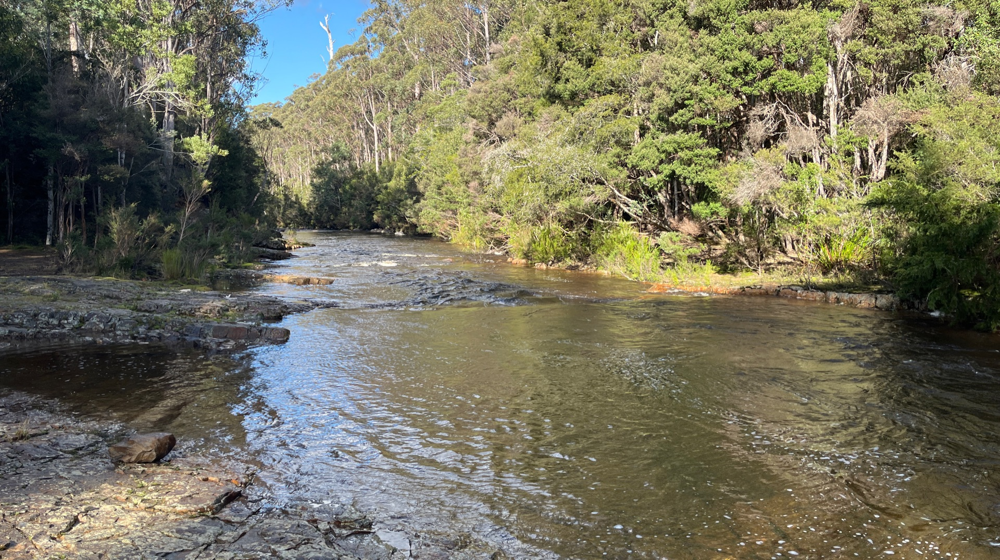](../../../../files/photos_and_files/019fc049-f5f7-7b27-aeed-4cef19863fdf-24e80dff2fad8d503180ebc433c2979fc5e10de7.jpg) [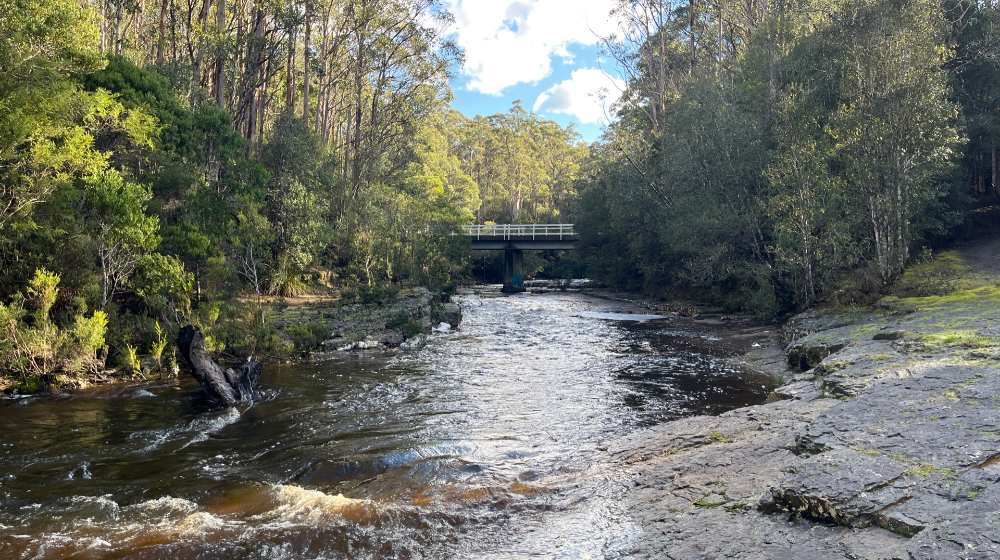](../../../../files/photos_and_files/019fc049-ef5c-739b-98bc-a2b0e2e0af73-c8d24ec5ffdc6afd822c504b68f47c66ebac656a.jpg) |

### 2026-08-02T11:31:11+00:00 — ESP100 Esperance River Cableway Above Dover Water Intake
**Observer:** Erika B  ·  **Location:** -43.334185, 146.9657096  ·  **ID:** `019fc020-24cc-7649-b730-2d101fbf443d`

[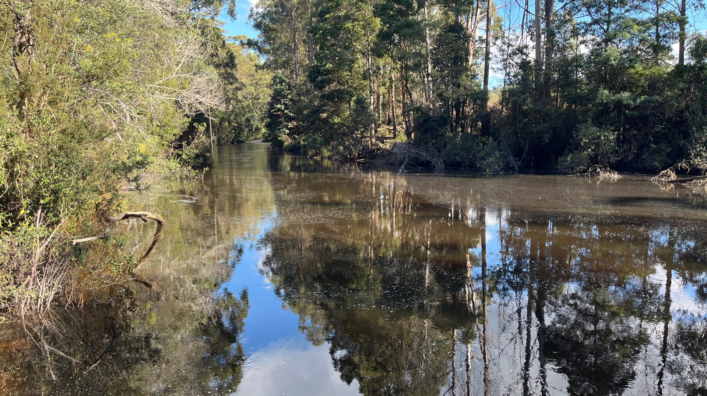](../../../../files/photos_and_files/019fc020-0cf7-7052-824d-60c8024e38b4-3bffb12dd84f87e474bae5d18bf7deca1d5f4470.jpg)

| Field | Value |
| --- | --- |
| Monitor's Initials (or alias) - PUBLIC | MH & Eb |
| Water Depth (cm) | 146 |
| Width (cm) | 2000 |
| Flowing | Medium |
| Rainfall Last 24h (mm) | 0 |
| Air Temperature (C) | 11 |
| Other Observations | Debris, Foam |
| Further / ad-hoc Observations | I’m |
| pH | 7.39 |
| Water Temperature (C) | 6.7 |
| Electrical Conductivity (mS / uS) | 60 |
| Electrical Conductivity Unit | uS micro-Siemens |
| Dissolved Oxygen %s | 100.8 |
| Dissolved Oxygen Temperature (C) | 6.0 |
| Turbidity (NTU) | 4.19 |
| Turbidity Measurement Type | 2100P Turbidimeter |
| Nutrient Samples Collected | None |
| Site Conditions Photograph - PUBLIC |  [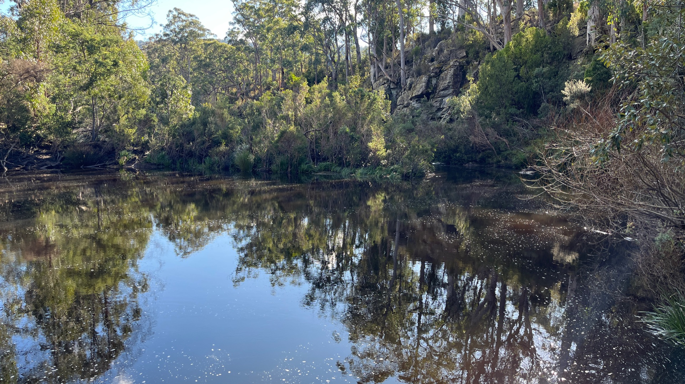](../../../../files/photos_and_files/019fc020-17c1-76d6-bf48-059818f990db-e31966331da7530deaa87f854b1b93d4c778e5c2.jpg) [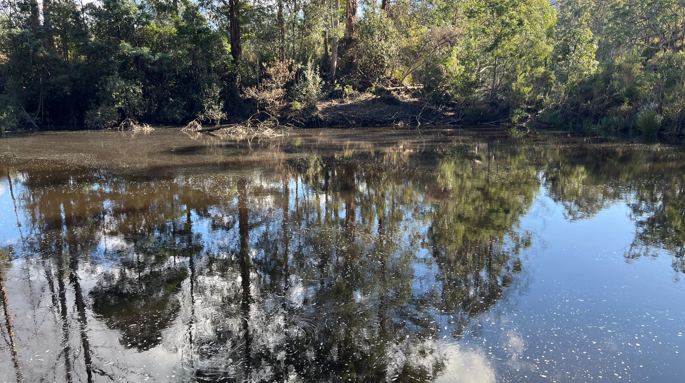](../../../../files/photos_and_files/019fc020-221c-72cf-9120-fb7dac2396d5-c4cadbdc0516e457e54bad3cf23b0b46c7d62c7b.jpg) |

### 2026-08-02T11:04:17+00:00 — DOV070 Dover Rivulet Huon Highway
**Observer:** mhdoverlc  ·  **Location:** -43.2976765, 147.0103537  ·  **ID:** `019fc00a-73f7-7261-bf5a-fd04ec3c9232`

[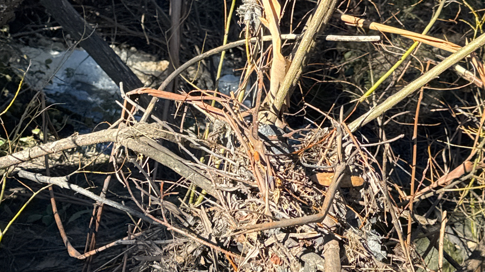](../../../../files/photos_and_files/019fc00a-2e86-7425-85f6-adc8efe711eb-8cbf0739ee4a13585fb46422a9643c89201930bc.jpg)

| Field | Value |
| --- | --- |
| Monitor's Initials (or alias) - PUBLIC | MH, EB |
| Water Depth (cm) | 15 |
| Width (cm) | 120 |
| Flowing | Medium |
| Rainfall Last 24h (mm) | 0 |
| Air Temperature (C) | 11 |
| Other Observations | Debris, Foam |
| pH | 7.23 |
| Water Temperature (C) | 6.9 |
| Electrical Conductivity (mS / uS) | 221 |
| Electrical Conductivity Unit | uS micro-Siemens |
| Dissolved Oxygen %s | 91.4 |
| Dissolved Oxygen Temperature (C) | 6.0 |
| Turbidity (NTU) | 26.7 |
| Turbidity Measurement Type | 2100P Turbidimeter |
| Nutrient Samples Collected | None |
| Site Conditions Photograph - PUBLIC |  [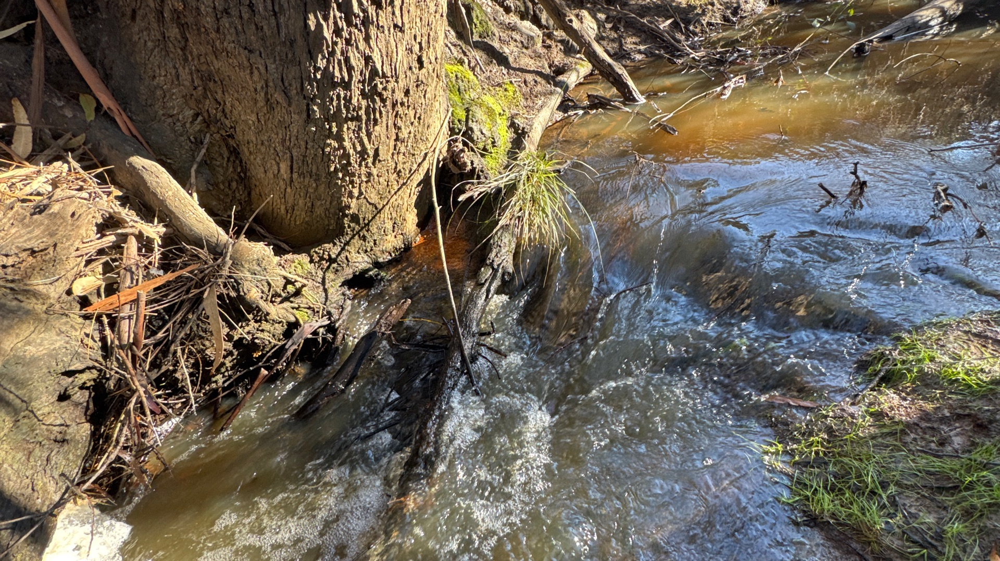](../../../../files/photos_and_files/019fc00a-5391-784a-b4e3-42b9ace8b417-40e02e0da724e6b2b7c60c2c7652b409aaff8b42.jpg) [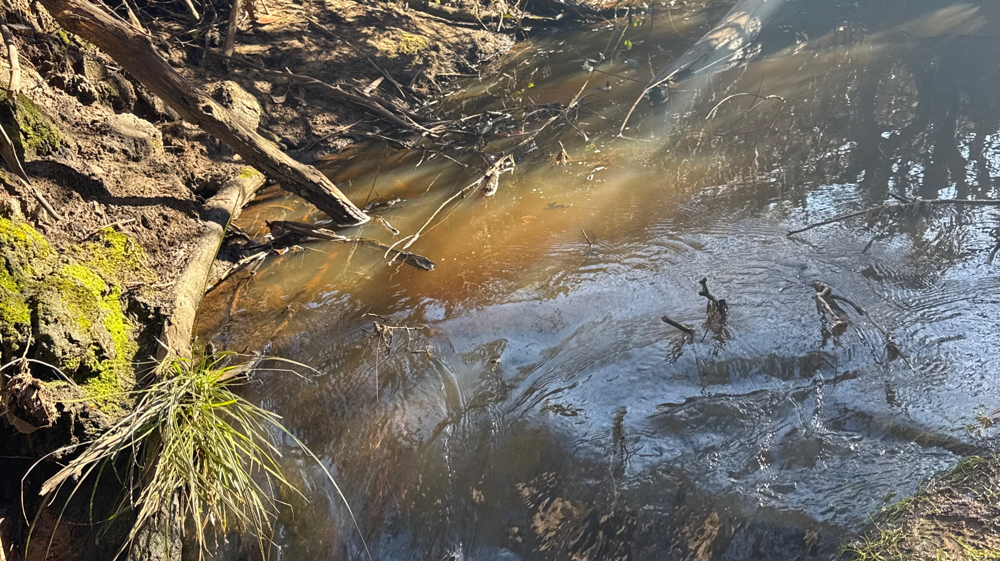](../../../../files/photos_and_files/019fc00a-71c2-7b31-b61c-f7bcb225dab6-ea9500e2c2bfb5f5bf56c38e0bea27e5772b613c.jpg) |

### 2026-08-02T10:34:08+00:00 — DOV130 Dover Rivulet Lagoon Kent Beach Rd
**Observer:** mhdoverlc  ·  **Location:** -43.3155877, 147.0230454  ·  **ID:** `019fbff3-a20e-70f9-a6b3-3b1b33744935`

[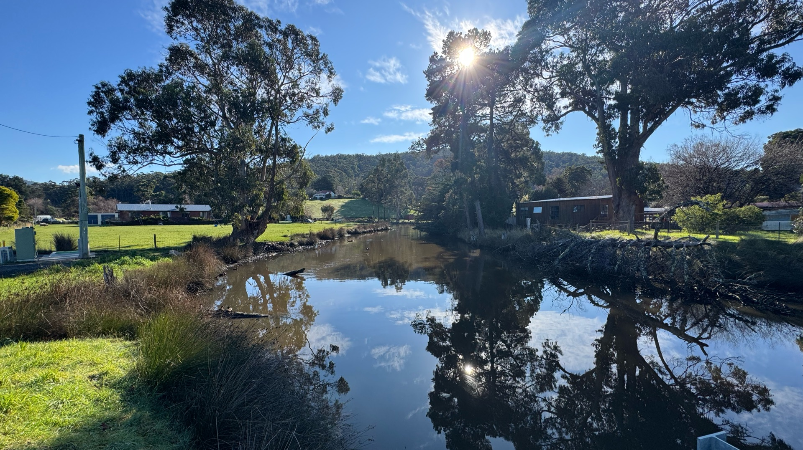](../../../../files/photos_and_files/019fbff3-8ed5-704c-b84f-1d349595a53d-5df920bcb7f91b36504a97319bef746a83baf168.jpg)

| Field | Value |
| --- | --- |
| Monitor's Initials (or alias) - PUBLIC | MH, EB |
| Water Depth (cm) | 100 |
| Width (cm) | 1100 |
| Flowing | Medium |
| Rainfall Last 24h (mm) | 0 |
| Air Temperature (C) | 10 |
| pH | 7.26 |
| Water Temperature (C) | 6.9 |
| Electrical Conductivity (mS / uS) | 2224 |
| Electrical Conductivity Unit | uS micro-Siemens |
| Dissolved Oxygen %s | 95.3 |
| Dissolved Oxygen Temperature (C) | 6.4 |
| Turbidity (NTU) | 25.2 |
| Turbidity Measurement Type | 2100P Turbidimeter |
| Nutrient Samples Collected | None |
| Site Conditions Photograph - PUBLIC |  [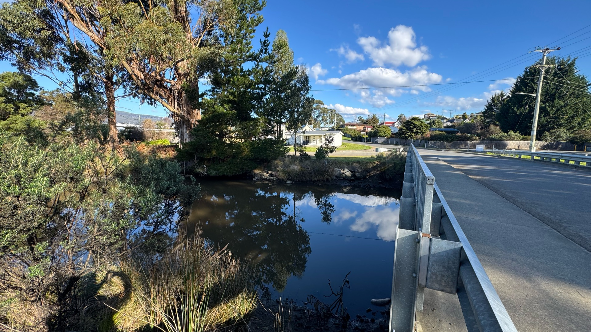](../../../../files/photos_and_files/019fbff3-96d8-7da0-a163-9c7db1d25cf1-d53a95e8871ddf87b1281c095dd5f61d68550bf5.jpg) [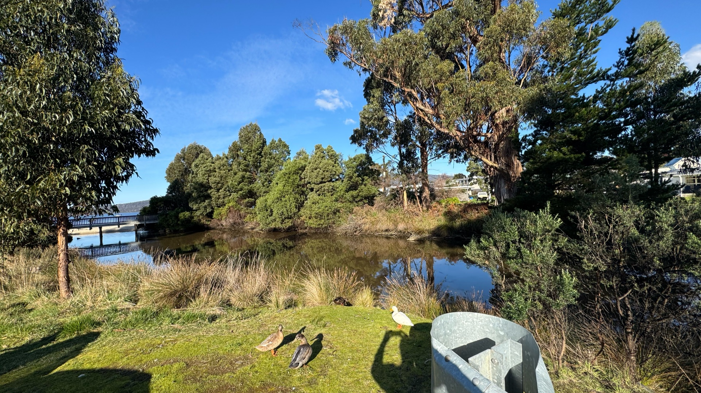](../../../../files/photos_and_files/019fbff3-9fdb-7f5c-86ab-48107dcde196-2df58c9f7e9e7ec73b3fb8f4c32a7030ba8a1cc4.jpg) |

### 2026-08-02T10:02:42+00:00 — DOV110 Dover Rivulet South Gate Market
**Observer:** mhdoverlc  ·  **Location:** -43.3105898, 147.0170049  ·  **ID:** `019fbfe4-1aa4-7f16-838a-ae6e260ef51c`

[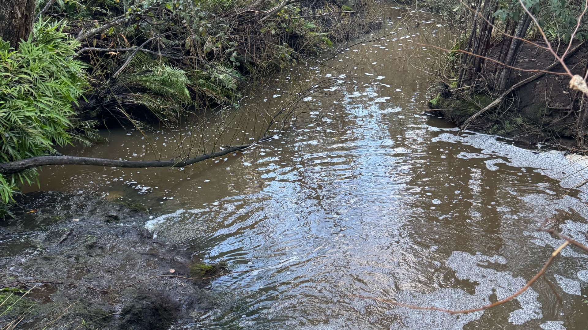](../../../../files/photos_and_files/019fbfe4-0d96-757e-9cce-3a39daf5d9b1-d1019fddce55560f208f806fd5673bc204f1c7bf.jpg)

| Field | Value |
| --- | --- |
| Monitor's Initials (or alias) - PUBLIC | EB MH |
| Water Depth (cm) | 20 |
| Width (cm) | 100 |
| Flowing | Medium |
| Rainfall Last 24h (mm) | 0 |
| Air Temperature (C) | 9 |
| Other Observations | Foam |
| pH | 7.42 |
| Water Temperature (C) | 6.3 |
| Electrical Conductivity (mS / uS) | 285 |
| Electrical Conductivity Unit | uS micro-Siemens |
| Dissolved Oxygen %s | 95.5 |
| Dissolved Oxygen Temperature (C) | 7.1 |
| Turbidity (NTU) | 23.9 |
| Turbidity Measurement Type | 2100P Turbidimeter |
| Site Conditions Photograph - PUBLIC |  [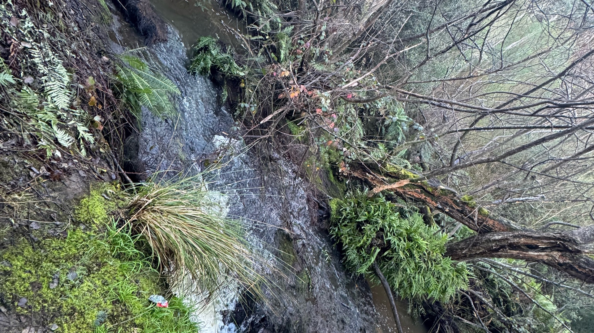](../../../../files/photos_and_files/019fbfe4-17e9-722d-b425-abd5a35fa949-732d8f9a942df6a9f02952c484f50aec7340b378.jpg) |

### 2026-06-14T12:50:00+00:00 — ESP050 Esperance River Conservation Area (maybe ESP010)
**Observer:** mhdoverlc  ·  **Location:** -43.298965, 146.9134378  ·  **ID:** `019ec64a-5093-760e-bf95-5cc35997280c`

[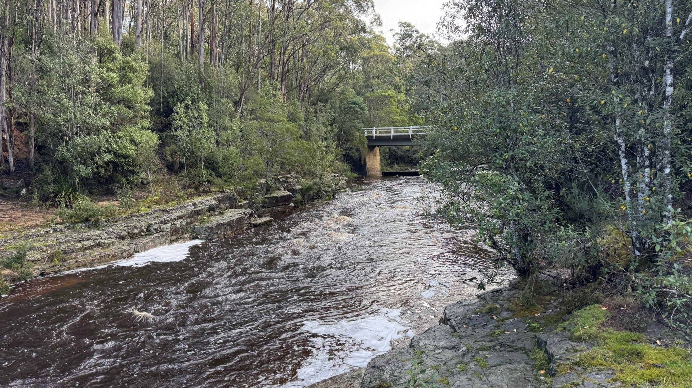](../../../../files/photos_and_files/019ec64a-430f-7985-bf9f-4a29691c5373-d7d56e9ed38dc992c8ab6c5fc1a5a58c814a229e.jpg)

| Field | Value |
| --- | --- |
| Monitor's Initials (or alias) - PUBLIC | EB JE MH |
| Water Depth (cm) | 50 |
| Width (cm) | 600 |
| Flowing | High |
| Rainfall Last 24h (mm) | 2 |
| Other Observations | Foam, Bubbles |
| Ph | 6.9 |
| Temperature (C) | 7.9 |
| Electrical Conductivity | 56 |
| Electrical Conductivity Unit | uS micro-Siemens |
| Dissolved Oxygen %s | 99.5 |
| Turbidity (NTU) | 6 |
| Turbidity Measurement Type | 2100P Turbidimeter |
| Nutrient Samples Collected | None |
| Site Conditions Photograph - PUBLIC |  [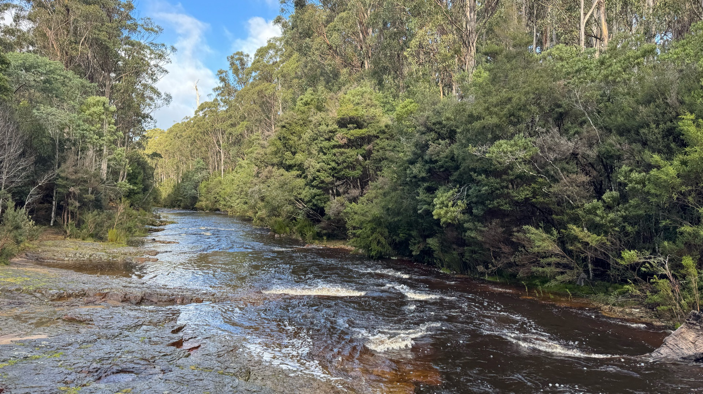](../../../../files/photos_and_files/019ec64a-4dd7-7684-9c57-92712606242a-078fd264247d6edb36a41d476487ea74a43d5e04.jpg) |

### 2026-06-14T12:25:00+00:00 — ESP100 Esperance River Cableway Above Dover Water Intake
**Observer:** mhdoverlc  ·  **Location:** -43.334185, 146.9657096  ·  **ID:** `019ec650-0f2e-7cad-9f82-beb9494685fc`

[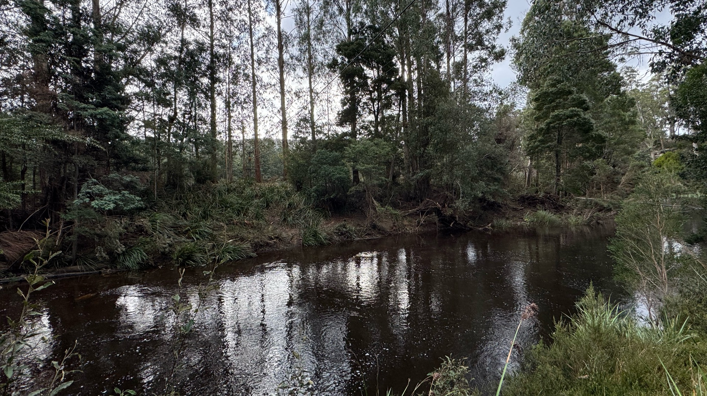](../../../../files/photos_and_files/019ec650-0c3b-723a-a28b-508bca84140c-d13af59804df274182c672065f3d3b2e0e4ab677.jpg)

| Field | Value |
| --- | --- |
| Monitor's Initials (or alias) - PUBLIC | EB JE MH |
| Water Depth (cm) | 150 |
| Width (cm) | 20000 |
| Flowing | High |
| Rainfall Last 24h (mm) | 2 |
| Other Observations | Foam |
| Ph | 7.4 |
| Temperature (C) | 8.3 |
| Electrical Conductivity | 71 |
| Electrical Conductivity Unit | uS micro-Siemens |
| Dissolved Oxygen %s | 99 |
| Turbidity (NTU) | 7 |
| Turbidity Measurement Type | Tube |
| Nutrient Samples Collected | None |
| Site Conditions Photograph - PUBLIC |  |

### 2026-06-14T11:40:00+00:00 — DOV130 Dover Rivulet Lagoon Kent Beach Rd
**Observer:** mhdoverlc  ·  **Location:** -43.3155877, 147.0230454  ·  **ID:** `019ec63f-1b33-7206-8be6-94b3d18c8812`

[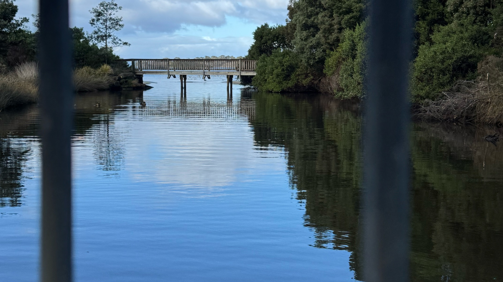](../../../../files/photos_and_files/019ec63f-1159-7d6f-8994-df079a712d29-5e30dace50883b278d89d2a137b6abd071287e0f.jpg)

| Field | Value |
| --- | --- |
| Monitor's Initials (or alias) - PUBLIC | JE EB MH |
| Water Depth (cm) | 200 |
| Width (cm) | 1500 |
| Flowing | Low |
| Other Observations | Rubbish, Debris |
| Further / ad-hoc Observations | Open to ocean, flowing out |
| Ph | 7.1 |
| Temperature (C) | 10.2 |
| Electrical Conductivity | 23 |
| Electrical Conductivity Unit | mS milli-Siemens |
| Dissolved Oxygen %s | 90 |
| Turbidity (NTU) | 7 |
| Turbidity Measurement Type | Tube |
| Nutrient Samples Collected | None |
| Site Conditions Photograph - PUBLIC |  [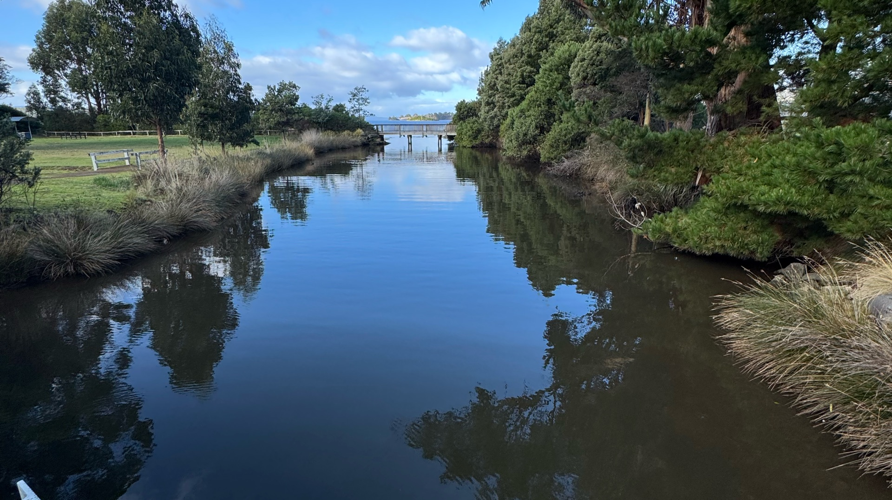](../../../../files/photos_and_files/019ec63f-17e1-7798-8432-5a14972a8f8f-5d0dbde4c2d3da1150501441e751f49245690297.jpg) |

### 2026-06-14T11:02:00+00:00 — DOV070 Dover Rivulet Huon Highway
**Observer:** mhdoverlc  ·  **Location:** -43.2976765, 147.0103537  ·  **ID:** `019ec637-17d2-74db-b524-e148df0e251a`

[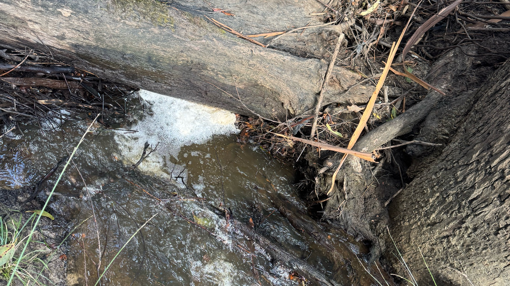](../../../../files/photos_and_files/019ec637-1503-7903-a2b6-9314cf911ba4-8c3519561e4aa2903288d0bf413784edf44883d8.jpg)

| Field | Value |
| --- | --- |
| Monitor's Initials (or alias) - PUBLIC | JE EB MH |
| Water Depth (cm) | 20 |
| Width (cm) | 100 |
| Flowing | High |
| Other Observations | Debris, Foam, Bubbles, Erosion |
| Hanna Combo Meter # | 98128 |
| TDScan Meter # | wp-84 |
| Ph | 7 |
| Temperature (C) | 8.7 |
| Electrical Conductivity | 274 |
| Electrical Conductivity Unit | uS micro-Siemens |
| Dissolved Oxygen %s | 92.8 |
| Turbidity (NTU) | 19 |
| Turbidity Measurement Type | Tube |
| Nutrient Samples Collected | None |
| Site Conditions Photograph - PUBLIC |  |

### 2026-06-14T10:20:00+00:00 — DOV110 Dover Rivulet South Gate Market
**Observer:** mhdoverlc  ·  **Location:** -43.3105898, 147.0170049  ·  **ID:** `019ec62d-2b1e-70b0-8e4c-afaedbf2ebae`

[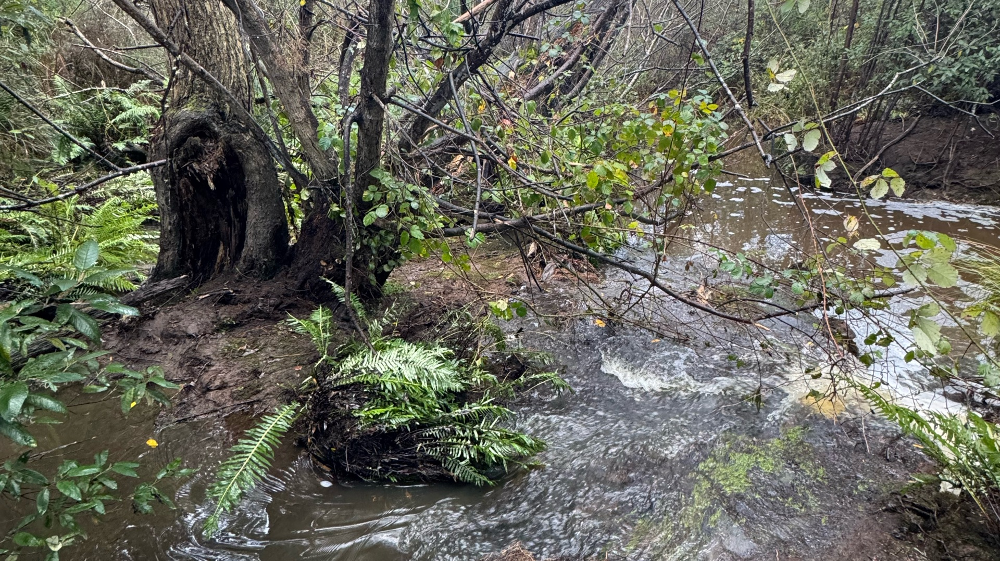](../../../../files/photos_and_files/019ec62d-2866-707c-89db-117aa6141ef0-b7ed5103e7577015492e6a92185f33f3650a9ba6.jpg)

| Field | Value |
| --- | --- |
| Monitor's Initials (or alias) - PUBLIC | JE EB MH |
| Water Depth (cm) | 10 |
| Width (cm) | 50 |
| Flowing | High |
| Other Observations | Foam, Erosion |
| Hanna Combo Meter # | 98128 |
| TDScan Meter # | Wp-84 |
| Ph | 7.0 |
| Temperature (C) | 8.6 |
| Electrical Conductivity | 350 |
| Electrical Conductivity Unit | uS micro-Siemens |
| Dissolved Oxygen %s | 95.2 |
| Turbidity (NTU) | 10 |
| Turbidity Measurement Type | Tube |
| Nutrient Samples Collected | None |
| Site Conditions Photograph - PUBLIC |  |

### 2025-11-29T10:27:00+00:00 — DOV110 Dover Rivulet South Gate Market
**Observer:** mhdoverlc  ·  **Location:** -43.3105898, 147.0170049  ·  **ID:** `019edd31-b841-79d1-bb48-e7b21a2d1822`

| Field | Value |
| --- | --- |
| Monitor's Initials (or alias) - PUBLIC | SR |
| Flowing | Medium |
| Ph | 7.3 |
| Temperature (C) | 10.6 |
| Electrical Conductivity | 317 |
| Electrical Conductivity Unit | uS micro-Siemens |
| Turbidity (NTU) | 20 |
| Turbidity Measurement Type | Tube |

---

_Licensing: project & contributor content is CC BY 4.0; uploaded third-party resources are not licensed for reuse; code is MIT. See [LICENSE.md](../../../../../LICENSE.md)._
